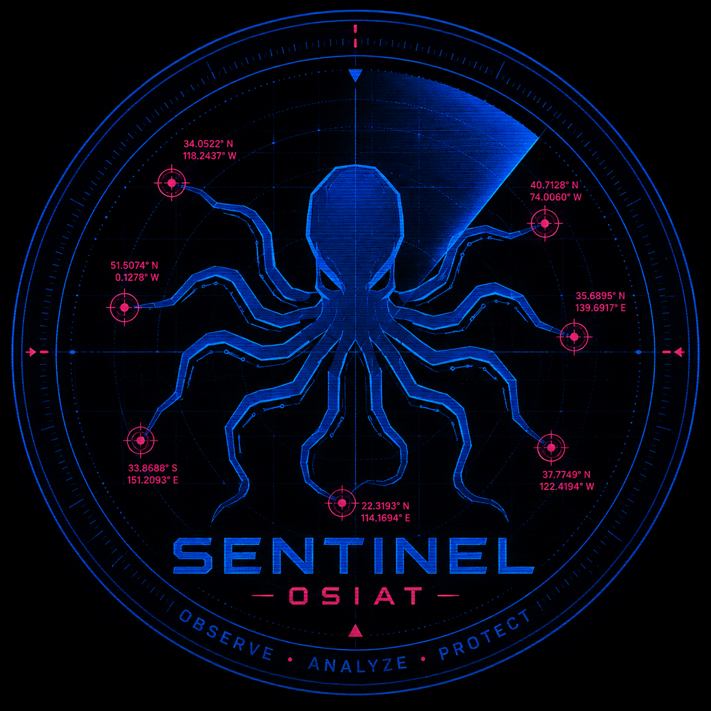

<p align="center">
  
</p>

# 🛡️ OS_Sentinel: Open-Source Civic Intelligence & Territorial Awareness


---

## 🌐 Link Rapidi del Nodo Operativo

| Risorsa | Descrizione | Stato Server |
| :--- | :--- | :--- |
| 🗺️ [**Mappa Interattiva (Radar)**](https://teknoirdev.github.io/Sentinel/) | Visualizzazione geo-spaziale degli incidenti informatici e urbani | **🟢 ONLINE** |
| 📊 [**Database Master (Google Sheets)**](https://docs.google.com/spreadsheets/d/1XrKSKSg-f9NuHifyutJveiXf6j9MqOPF_svnl_1qMUA/edit?usp=sharing) | Archivio cloud strutturato, normalizzato e storicizzato | **👁️ CONSULTABILE** |

---

## 🛑 Pilastri Fondamentali & Privacy (GDPR)

Per evitare che il progetto si trasformi in "schedatura" o sorveglianza di massa, OS_Sentinel applica rigidamente questi tre vincoli di progettazione fin dalla sua architettura di base:

1. **Zero Dati Personali (No PII):** Non viene memorizzato alcun dato relativo a persone fisiche (nomi, targhe, volti, indirizzi privati o specifici numeri civici).
2. **Clessidra Temporale:** Gli eventi non registrano mai l'orario esatto in cui sono avvenuti. I dati vengono aggregati su base puramente mensile (es. *Dicembre 2023*) per impedire correlazioni e re-identificazione.
3. **Geolocalizzazione Approssimativa:** La precisione cartografica varia in base alla categoria. Per la *Sicurezza Urbana* si ferma rigorosamente al livello di Comune e Macro-Quartiere/Zona (es. *Quartiere Vazzieri*), senza mai esporre coordinate GPS puntuali di abitazioni private.

---

## 📂 Struttura del Progetto

```text
Sentinel/
├── sentinellogo.png          # Logo ufficiale del progetto (Cyber-Radar Octopus)
├── README.md                 # Questo file (Presentazione, Note Tecniche e Indice)
├── index.html                # Interfaccia web e codice sorgente della mappa interattiva (Leaflet)
├── contributing.md           # Linee guida e policy per l'inserimento dei dati dei collaboratori
└── LICENSE                   # Licenza MIT (Codice totalmente libero e protetto)
